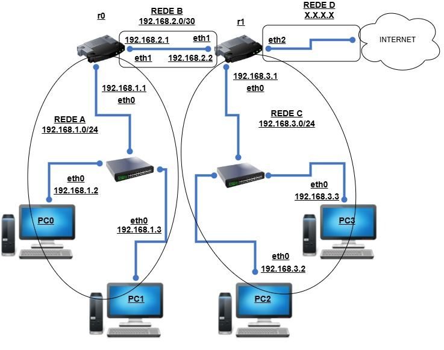

# Rede-Básica-Kathará

* ### Necessário para rodar:
    - [WSL Latest](https://github.com/microsoft/WSL/releases "Releases do WSL") instalado
    - [Kathara](https://www.kathara.org/download.html "Página de download") instalado
    - [Docker desktop](https://docs.docker.com/desktop/ "Downloads no final da página") aberto
    - Abra a pasta clonada no cmd e digite o seguinte comando:
          "``` mkdir r0, r1, pc0, pc1, pc2, pc3 ```"
      > Isso ira criar as pastas necessárias para que a emulação funcione

* ### Inicialização:
    - Ainda no cmd da pasta clonada, utilize "```kathara lstart```" para iniciar a emulação
      > Após iniciá-la, use "```kathara list```" caso queira mais detalhes sobre a emulação

* ### Testes:
    - Todas os computadores e roteadores estão conectados entre si:
        - Utilize ```ping [ip da máquina]``` para testar essas conexões
          > O roteador ```r1``` tem uma "ponte" para se conectar com a internet real, você pode pingar ips reais utilizando qualquer uma das máquinas presentes na emulação
        - Utilize ```traceroute [ip da máquina]``` para ver o caminho que o pacote precisa tomar para que chegue em outra máquina

### Topologia:



[Topologia no Draw.io](https://drive.google.com/file/d/1WPr9Ei1yLDAToAIUH0xiuMwlwGKGnEY1/view?usp=sharing)

### To do:
* #### ~~Reorganizar topologia de rede~~
